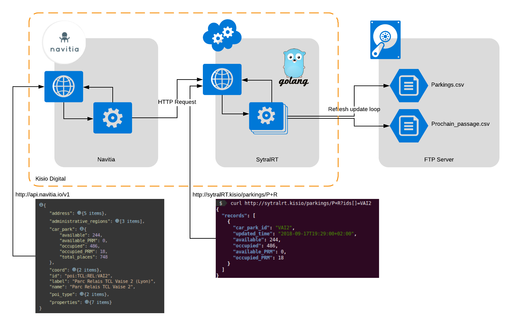

[](https://github.com/CanalTP/forseti/tag)
[](https://codecov.io/gh/CanalTP/forseti)

# Forseti

## Introduction

Forseti is the god of justice and **reconciliation** in [Norse mythology](https://en.wikipedia.org/wiki/Forseti).
We use it like this for the [navitia project](https://github.com/CanalTP/navitia). It aims to give jormungandr with **realtime data** provided by external services.<br>
The complexity of reading is masked by this one to provide a simple output webservice. Several methods is used to catch the realtime data :

- Read files on a Ftp server (Xml, json, csv, etc...)
- Call an external Api

## Architecture

### Written in

Forseti is written in **Go**.<br>

### APIs

Each service is exposed like an API. The web API is powered by [gin](https://github.com/gin-gonic/gin).<br>
The API list is as follows :

- `/status` exposes general information about the webservice
- `/metrics` exposes metrics in the prometheus text format
- [`/departures`](https://github.com/canaltp/forseti/blob/master/internal/departures/readme.md) returns the next departures for a stop (parameter `stop_id`). [doc](https://github.com/canaltp/forseti/blob/master/internal/departures/readme.md)
- `/parkings/P+R` returns real time parkings data. (with an optional list parameter of `ids[]`)
- [/equipments](https://github.com/canaltp/forseti/blob/master/internal/equipments/readme.md) returns informations on Equipments in StopAreas. [doc](https://github.com/canaltp/forseti/blob/master/internal/equipments/readme.md)
- `/free_floatings?coord=2.37715%3B48.846781` returns informations on freefloatings  within a certain radius as a crow flies from the point
- [/vehicle_occupancies] (https://github.com/canaltp/forseti/blob/master/internal/vehicleoccupancies/readme.md) returns occupany of a vehicles at a stop. [doc](https://github.com/canaltp/forseti/blob/master/internal/vehicleoccupancies/readme.md)

For each service, a goroutine is created to handle the refresh of the data by downloading them every refresh-interval (default: 30s) and load them. Once these data have been loaded there is swap of pointer being done so that every new requests will get the new dataset.



### Options

Sometimes, options exists to **active/Deactivate** the periodic refresh of data for the Api.<br>
`/free_floatings` and `/vehicle_occupancies` dispose of that:

- `/status?free_floatings=false` deactivates the periodic refresh of data for api `/free_floatings`
- `/status?vehicle_occupancies=false` deactivates the periodic refresh of data for api `/vehicle_occupancies`

After the deactivation the service keeps working with the last loaded data.

## Build

To build this project you need at least [go 1.15](https://golang.org/dl)<br>
Dependencies are handled by go modules as such it is recommended to not checkout this in your *GOPATH*.

To build the project you just need to run the following command, at the root of the project:

```shell
make build
```

If you want to run the tests:

``` shell
make test
```

## Run it

Forseti run with a bunch of input parameters:

```shell
./forseti -h
```

For each Api, you need to provide several parameters to load it. These parameters are described within the concerned Api doc. See above<br> 
As an example, for the equipment API:

```
./forseti --equipments-uri file:///forseti/fixtures/NET_ACCESS.XML --equipments-refresh=1s
```

## With Docker

Use the pre-built docker image: [navitia/forseti](https://hub.docker.com/r/navitia/forseti)
Several **tags** exists:

- release/latest - The main tag. This is the last stable version
- X.X.X - Each main version is tagged with a num
- master - The current branch of development

A docker compose is available for a local run.<br>

```
docker-compose --compatibility up
```

connect to : http://127.0.0.1:8088<br>

You have to tweak the environment section for the occupancy Api.<br>
The directory `~/workspace/data/forseti` must contain the data necessary: `extraction_courses.csv` and `mapping_stops.csv`

## Contribute

To contribute, create a Github PR from your fork, we will please to read your contribution.<br>
Don't forget to **lint** and **format** your code before to push, otherwise the CI will be merciless with you.<br>

Install the linter.

```shell
# Install linter
make linter-install
```

Now you can

```shell
# Run linter
make lint

# Run formatting
make fmt
```
 
